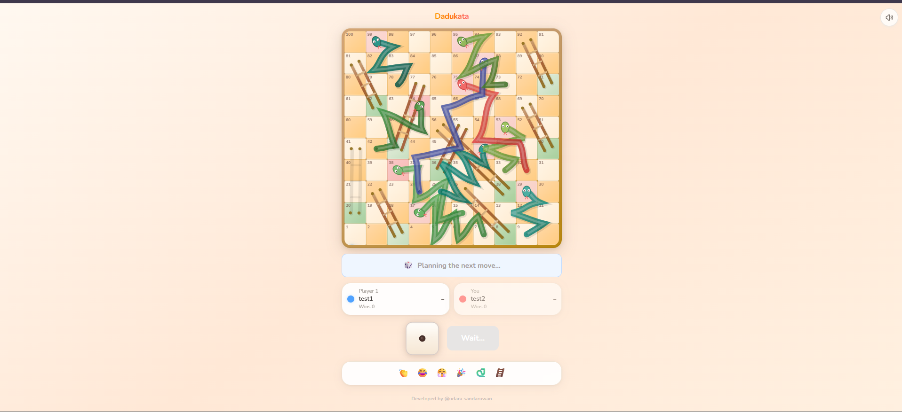

# Dadukata

A simple online Snakes & Ladders game built with React, Vite, TypeScript, and Firebase Realtime Database.

Live game: [https://udarasadaruwan.github.io/dadukata-game/](https://udarasadaruwan.github.io/dadukata-game/)

## Screenshot

Then it will show here:



If the image does not show on GitHub, make sure:

- The file is named exactly `game.png`.
- The folder path is exactly `public/screenshots/`.
- The image has been committed and pushed to GitHub.

## How To Add The Screenshot

1. Create a folder named `screenshots` inside the `public` folder.
2. Add your screenshot image into that folder.
3. Rename the image to `game.png`.
4. Commit and push the file.

Example path:

```text
public/screenshots/game.png
```

## Features

- Create and join online rooms
- Share invite links
- 2-4 player support
- Dice rolling and pawn movement animations
- Bonus roll on 1 or 6
- Win counter for rematches
- Emoji reactions

## Run Locally

```bash
npm install
npm run dev
```

## Build

```bash
npm run build
```
